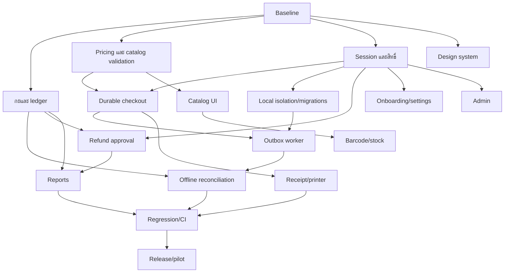

# แผนพัฒนา Sunha POS ที่นำไปแจกงานได้

อ้างอิงผลตรวจ 10 กันยายน 2026; จัดทำ 11 กันยายน 2026 ข้อเสนอทั้งหมดในเอกสารนี้ยังเป็นงานที่ต้องลงมือทำ ไม่ใช่สถานะ completed

## 1. เป้าหมายและวิธีทำงาน

เป้าหมายคือเจ้าของร้านตั้งร้านได้เอง แคชเชียร์ขายสินค้า/พิมพ์/คืนเงินตามสิทธิ์ ผู้จัดการกระทบยอดและปิดกะได้ซ้ำทุกวัน และรายการที่ระบบแจ้งว่าบันทึกแล้วไม่สูญหายหรือถูกบันทึกซ้ำเมื่อแอป/เครือข่ายขัดข้อง ทุกหน้าที่อยู่ในเมนูรุ่นส่งมอบต้องมี action จริงและผ่าน UAT

ให้เริ่มจาก freeze working tree เป็น commit ที่ทีมรับรู้ร่วมกัน เปิด branch `codex/pos-readiness-<task-id>` ต่อชุดงานเล็กตามนโยบาย repository โดยรักษางานค้างของผู้ใช้ ไม่ merge งานหลาย phase ใน PR เดียว ทุก PR อ้าง Fxx/Txx, ก่อน–หลัง, schema/API ที่เปลี่ยน, วิธีทดสอบ, และผลทดสอบบน commit นั้น

ผู้รับผิดชอบในแผนเป็นบทบาทที่ต้องมอบหมายให้บุคคลจริง: BE = backend, POS = React Native, QA = ทดสอบ, UX = ออกแบบ, OPS = build/deploy, PM = ตัดสินกติกาธุรกิจ เวลาเป็น **person-days ประมาณการ** รวม implementation/test ระดับงาน แต่ไม่รวมเวลารอ hardware/provider หรือปรับ requirement

## 2. ลำดับส่งมอบและ dependencies

| Phase               | งาน                     | เกณฑ์ออกจาก phase                                                 |
| ------------------- | ----------------------- | ----------------------------------------------------------------- |
| A: baseline         | T01                     | commit/test dataset/ขอบเขตที่ตรวจซ้ำได้                           |
| B: เงินและตัวตน     | T02,T03,T04,T05         | ยอด UI/server ตรง, หลายกะผ่าน, retry ไม่ขายซ้ำ, สิทธิ์ผูก session |
| C: offline และบัญชี | T06,T07,T08,T09,T10     | restart/retry/migration/reconciliation ผ่าน; ตั้งร้าน/คืนเงินครบ  |
| D: หน้าจอและอุปกรณ์ | T11,T12,T13,T14,T15,T16 | ทุกหน้า usable ตาม role; receipt/barcode/hardware ผ่าน            |
| E: รับรอง release   | T17,T18                 | CI + Android UAT + restore drill + pilot ผ่าน                     |

UX specification และ test fixtures ทำควบคู่ได้ แต่ห้ามปิด ticket UI จนทดสอบร่วมกับ API/สิทธิ์จริง ไม่มีการอ้างว่า frontend เสร็จเพราะใช้ mocked success response อย่างเดียว

## 3. งานรายละเอียด

### T01 — ตั้ง baseline และเปลี่ยน completion ให้มีหลักฐาน

**เจ้าของ:** Lead + QA • **ประมาณ:** 1–2 วัน • **ก่อนเริ่ม:** ไม่มี • **แก้:** F18

อ่าน `README.md`, `production-ready-plan.md`, `.github/workflows/ci.yml`, package scripts และ git diff แยกสิ่งที่ implemented, unit-tested, integration-tested, device-tested, production-verified ออกจากกัน สร้าง release manifest ที่มี commit, Node/pnpm/DB versions, app build ID, migration version และ test dataset

จัด test tenant อย่างน้อยสองร้าน พร้อม OWNER/MANAGER/CASHIER, เครื่องหนึ่ง/สองเครื่อง, สินค้าหลายหน่วย/required modifier, catalog versions, กะเก่า/กะใหม่ และบิลคืนข้ามวัน ใช้ฐานข้อมูลแยกที่ชื่อระบุ test ชัด

**ส่งมอบ/ตรวจรับ:** clean reproducible checkout; runbook สร้าง DB ว่าง + migrate + seed + start ได้; audit findings ทุกข้อมี owner/ticket; README ตรง scripts จริง; native printer files ที่ค้างได้รับการตัดสินใจว่าจะเก็บหรือย้ายแล้ว ไม่มีการลบการแก้ของผู้อื่นโดยอัตโนมัติ

### T02 — แก้กะและสมุดเงินสดให้คำนวณตามธุรกรรมจริง

**เจ้าของ:** BE + QA • **ประมาณ:** 4–6 วัน • **รอ:** T01 • **แก้:** F01,F05,F08 บางส่วน

ไฟล์หลัก `prisma/schema.prisma`, migration ใหม่, `shifts/shift.service.ts`, contracts และ `app/shifts.tsx`

1. ลบ unique `(storeId,isOpen)` ผ่าน migration ใหม่ แล้วเพิ่ม unique index `storeId WHERE isOpen=true` เก็บ index ประวัติตาม store/openedAt; ไม่แก้ baseline ที่ apply แล้ว
2. เพิ่ม shiftId ให้ order/ธุรกรรมการเงินตามแบบจำลองที่ตกลง Payment/reversal ควรระบุกะที่เงินเคลื่อนไหวจริง เงินคืนบิลเก่าต้องเข้า cash ledger ของกะคืน ไม่ใช่กะเดิม
3. กำหนด amount จาก input เป็น magnitude >0 และให้ server derive sign จาก CASH_IN/CASH_OUT หรือ enforce sign อย่างชัดทั้ง contract/service อย่าให้ client เป็นผู้ตัดสินเครื่องหมายเพียงจุดเดียว
4. ใช้ transaction + locking/conditional transition ป้องกันขาย/เงินเข้าออกแข่งกับการปิดกะ บันทึก audit ใน transaction เดียว และให้ opening/closing idempotent
5. เพิ่ม current-shift/read-history API และ UI ที่แสดง action ตามสถานะจริง ปิดแบบ blind count แล้วค่อยแสดง expected/variance พร้อมเหตุผลเมื่อเกินเกณฑ์
6. การ backfill ข้อมูลเก่า: map เฉพาะรายการที่จับคู่กะได้แน่นอน; ambiguous/ungrouped บันทึกเป็น reconciliation task ไม่เดากะย้อนหลัง

**ตรวจรับ:** เปิด–ปิด 10 รอบต่อร้านได้; concurrent open ได้หนึ่งกะ; เริ่ม 100,000 + sale cash 55,000 + cash-in 10,000 − cash-out 20,000 − refund 11,000 = expected 134,000; money movement หลัง closing ถูกปฏิเสธหรือเข้ากะใหม่ตาม transaction; ไม่อนุญาต checkout โดยไม่มีกะในรุ่นนี้; refund ข้ามกะเข้า ledger ถูกกะ; audit กับผลธุรกรรมสำเร็จ/rollback ร่วมกัน

### T03 — ใช้ pricing เดียวกันและตรวจสินค้า ณ checkout

**เจ้าของ:** BE + POS • **ประมาณ:** 3–5 วัน • **รอ:** T01 • **แก้:** F02,F04,F19 บางส่วน

ไฟล์ `packages/domain`, `packages/contracts`, `orders/order.service.ts`, `app/index.tsx`, `auth-client.ts`

เพิ่ม dependency `@sunha/domain` ให้ POS ใช้ money/quantity strings ตลอดการคำนวณ แยก formatter ออกจาก arithmetic อ่าน tax/modifier/unit snapshot ครบ แสดง subtotal, discount, tax, total, tendered, change จากผล engine เดียวกัน ก่อนยืนยันออนไลน์ให้ quote หรือ validate version กับ server; หากราคาเปลี่ยนให้ผู้ขายเห็นยอดใหม่และยืนยันใหม่ ไม่ silently charge

server ตรวจ active item/unit, tenant/store ownership, quantity >0, multiplier >0, modifier assignment และ price validity ภายใน consistency boundary ที่เหมาะสม กำหนด mixed tax modes ว่ารองรับหรือป้องกันตั้งค่าผสมตั้งแต่ต้น ห้ามปล่อยขายแล้วค่อยพบข้อผิดพลาดที่ไม่อธิบาย

reset discount/payment draft เมื่อบิลสำเร็จ แต่รักษา draft เมื่อ validation/network ยังไม่ยืนยันผล ขอบเขตส่วนลดต้องได้รับ permission ฝั่ง server และอยู่ใน audit

**ตรวจรับ:** ใช้ golden fixtures ชุดเดียวบน POS/API สำหรับ exclusive/inclusive, ส่วนลด fixed/%, modifier, quantity เศษ, rounding และเงินจำนวนมาก; 10,000 + tax 10% รับ 20,000 ต้อง total=11,000/change=9,000 ทุกจุด; บิลถัดไปไม่มีส่วนลดเก่า; item/unit inactive ถูกปฏิเสธ; display/server mismatch ต้องไม่ตัดเงินแบบเงียบ

### T04 — ทำ session พนักงานและเครื่องที่พิสูจน์ตัวตนได้

**เจ้าของ:** BE + POS • **ประมาณ:** 5–8 วัน • **รอ:** T01 • **แก้:** F03,F11 บางส่วน

ไฟล์ auth services/guards, devices/employees, POS token-storage/api-client/root layout/PIN

เพิ่ม employee session credential ที่ server ออกหลัง verify PIN โดยผูก tenant/store/employee/device/session expiry ไม่ใช้ x-employee-id เป็นหลักฐานสิทธิ์ ตรวจ device enrollment และ proof ที่ผูกเครื่องจริงตาม threat model เก็บ secret/key ใน Keystore และแยก owner account session จาก cashier session ชัดเจน verify-pin ต้องคืน session credential ไม่ใช่เพียง employee profile

ทำ root state: boot → restoring → signed-out/onboarding/locked/ready, ป้องกัน deep link เข้าหน้าธุรกิจโดยไม่พร้อม ต่อ PIN screen เข้ากับ API แสดงชื่อพนักงาน, attempts/lockout, switch/lock; owner ต้องตั้ง PIN ได้ผ่าน reauthentication ที่เหมาะสม

เพิ่ม refresh แบบ single-flight, token rotation แบบ atomic consume ฝั่ง server, retry request ที่ปลอดภัยเพียงครั้งเดียวหลัง refresh; logout revoke session และจัดการ local queue ก่อนเปลี่ยน tenant ไม่ลบรายการขายค้างทิ้ง เมื่อ PIN/session หมดอายุต้อง re-auth ก่อน action ที่เพิ่มสิทธิ์

**ตรวจรับ:** เปลี่ยน header employee/device โดยไม่มี session ที่ถูกต้องไม่ได้เพิ่มสิทธิ์; cashier ไม่กลายเป็น owner; login บนเครื่องที่สองไม่แอบใช้ device แรก; 401 พร้อมกันหลาย request refresh ครั้งเดียว; token เก่า replay ไม่ได้; PIN ผิด/locked ไม่ผ่าน; app restart/direct route ส่งไปสถานะถูกต้อง และ cart ไม่สูญเมื่อ session หมดอายุ

### T05 — Durable checkout และผล request ที่ไม่แน่ชัด

**เจ้าของ:** POS + BE • **ประมาณ:** 4–6 วัน • **รอ:** T03,T04 • **แก้:** F06,F08

สร้าง checkout draft/operation พร้อม UUID จาก crypto API แล้ว persist ก่อน network เก็บ canonical payload/hash และสถานะ `DRAFT → SUBMITTING → CONFIRMED` หรือ `PENDING_SYNC/NEEDS_REVIEW` แยก retry ของบิลเดิมจากการสร้างบิลใหม่ การแก้ payload หลัง submit ต้องสร้าง revision ชัดเจน

server idempotency ต้องตรวจ tenant+key+payload hash: key เดิม payload เดิมคืนผลเดิม; key เดิม payload ต่างคืน conflict ที่ client อธิบายได้ มี query/reconcile จาก clientOrderId เพื่อแก้สถานะ ambiguous บันทึกสำเร็จของ local sale/receipt และการล้าง cart ใน SQLite transaction เดียวกัน

fetch ต้องมี timeout/cancel และแยก network/timeout/4xx/5xx ไม่เหมารวมว่าความล้มเหลวทุกแบบเป็น offline sale Print เป็นงานแยกหลัง sale confirmed/accepted ไม่ทำ checkout ใหม่เมื่อ print ล้มเหลว

**ตรวจรับ:** ตัด response หลัง server commit แล้ว retry/restart 10 ครั้งยังมี order/payment/receipt ชุดเดียว; process ตายก่อนส่ง/ระหว่างส่ง/หลัง ACK/ก่อนล้าง cart กู้คืนได้; disk full ต้องไม่แสดงว่ารับเงินสำเร็จ; double tap ป้องกันใน client และ server; payload conflict มี recovery ที่ไม่ขายซ้ำ

### T06 — Outbox worker ที่ retry และ resume ได้จริง

**เจ้าของ:** POS + BE • **ประมาณ:** 4–6 วัน • **รอ:** T05,T08 • **แก้:** F07,F08

ใช้ nextRetryAt แบบ epoch integer และ exponential backoff ตาม attempt จริงพร้อม jitter; migrate ค่าเก่า; แยก push/ack/pull error handling ไม่ย้อน ACKED เป็น PENDING เมื่อ pull ล้ม เพิ่ม single-flight worker/atomic claim กับ lease สำหรับ SYNCING; recover claim ที่ค้างหลัง restart

server apply operation และบันทึกผลใน transaction/กลไก idempotency เดียวกันสำหรับทุกประเภท ไม่ใช่ checkout อย่างเดียว; bind actor จาก authenticated session, ตรวจ operation ownership เมื่อเจอ key ซ้ำ; persist/honor dependsOn ด้วย schema ที่รองรับและ topological processing; ระบุผล dependency failed ชัดเจน

**ตรวจรับ:** retry ข้ามเวลาในวันเดียวกันและข้ามวันทำงาน; push สำเร็จ pull ล้มไม่ย้อนสถานะ; sync นานเกิน interval ไม่ส่งซ้ำแบบขนาน; replay CASH_MOVEMENT/OPEN_SHIFT ไม่ทำซ้ำ; crash หลัง apply ก่อน ACK ไม่เกิด side effect ซ้ำ; dependencies ไม่สลับแม้ timestamps เท่ากัน

### T07 — กติกา offline, local stock และหน้ากระทบยอด

**เจ้าของ:** BE + POS + PM • **ประมาณ:** 5–8 วัน • **รอ:** T02,T06 • **แก้:** F08,F14,F16

persist lease/policy ที่ยืนยันแล้วพร้อม version/expiry/last-success; renew ขณะออนไลน์; offline boot ต้องอ่านได้ ให้ระบบตรวจสิทธิ์ขายก่อนรับเงิน ไม่ใช่แค่ fallback หลัง request fail เก็บ local inventory reservation และ local receipt/sale snapshot ที่ตรวจย้อนหลังได้

กำหนดเรื่องสำคัญเป็น ADR: ราคา/ภาษีใช้ version เวลาขาย, จำนวน stock ที่ให้ขาย offline, เครื่องที่สอง/เครื่องถูก revoke, ขายนอก lease, clock skew, reconcile ที่เลย lease หลังขายไปแล้ว การใช้ timestamp ของอุปกรณ์เพียงอย่างเดียวไม่ใช่หลักฐานที่เชื่อถือได้ ควรมี signed lease/monotonic sequence หรือ equivalent proof และช่องทาง review โดย manager

เก็บ occurredAtDevice, receivedAtServer, businessDate, catalogVersion, shift reference และ original actor ต่อ operation อย่า reprice ย้อนหลังโดยไม่ปรากฏ discrepancy Implement pull apply local projections ก่อน advance cursor และทำ catalog refresh เมื่อ version เปลี่ยน

Sync Center แสดง local pending/syncing/review และ server results พร้อมจำนวน/อายุ/เหตุผล/ยอดเงิน ปุ่ม retry เฉพาะ error ที่ retry ได้; review ต้องมี resolve/adjust/refund workflow พร้อม audit ปิดกะต้องตรวจ queue ที่เกี่ยวข้องจากเครื่องในกะและสถานะ server ให้ครบ

**ตรวจรับ:** offline 2 ชั่วโมง restart แล้วขายต่อภายใต้ lease ได้; stock ท้องถิ่นไม่ติดลบตาม policy; reconnect แล้ว order/เงิน/stock ตรงทุกบิล; sale ก่อนหมด lease แต่ sync ทีหลังไม่หาย; business date ไม่ย้ายตามเวลารับ; จำนวน pending ที่หน้าขาย/Sync Center ตรง local DB; ไม่ปิดกะข้ามรายการที่ไม่กระทบยอด

### T08 — Local DB migration, tenant partition และ encryption

**เจ้าของ:** POS + OPS • **ประมาณ:** 3–5 วัน • **รอ:** T04 • **แก้:** F09

ทำ numbered migrations ใน transaction ตรวจ version จริงก่อน ALTER; ห้ามเขียน version ใหม่ก่อนสำเร็จ แบ่ง data ด้วย tenant/store/device scope หรือ DB ต่อ identity ที่ชัดเจน รวม cart/catalog/outbox/receipt/printer/session context; ใส่ guard ไม่ส่ง outbox ต่างร้านด้วย session ปัจจุบัน

เปิด SQLCipher ใน native build และใช้ random key จาก crypto ที่เก็บใน Keystore; ยืนยันว่าข้อมูลอ่านไม่ได้เมื่อไม่มี key อย่าถือว่าเก็บ key แล้วเท่ากับเข้ารหัสแล้ว ดูแนวคิด configuration จาก [Expo SQLite documentation](https://docs.expo.dev/versions/v54.0.0/sdk/sqlite/) แต่ต้องตรวจ API และ native plugin ของ Expo 57 ที่โปรเจกต์ติดตั้งก่อนใช้ ไม่คัด config ต่างรุ่นตรง ๆ

กำหนด logout/switch-store/restore policy: ถ้ามีรายการค้างต้อง sync หรือ lock queue ตาม tenant เพื่อส่งต่อภายหลัง ห้ามล้างเพื่อแก้ปัญหา login หาก web อยู่ใน scope ให้ทำ platform storage adapter และ auth design ที่เหมาะสม; หากเป็น preview-only ให้แจ้งชัดและอย่าให้เข้าใจว่าเป็น POS ที่ทำธุรกรรมได้ ใช้ [Expo Router authentication](https://docs.expo.dev/router/advanced/authentication/) เป็นแนวทางแยก platform และ protected routes

**ตรวจรับ:** upgrade จาก schema รุ่นเก่าที่มี cart/outbox โดยไม่หาย; migration fail rollback/version ไม่ขยับ; เปลี่ยนร้านไม่เห็นสินค้า/บิล/queue ร้านก่อน; native DB encrypted จริง; lost key/disk full/restore มีข้อความและ runbook ไม่ reset เงียบ

### T09 — Refund approval และคืน stock จาก snapshot

**เจ้าของ:** BE + POS • **ประมาณ:** 3–5 วัน • **รอ:** T02,T04 • **แก้:** F10

แยกความสามารถ cashier ขอคืนและ manager อนุมัติ ไม่ต้องให้ cashier อ่าน employee management ทั้งหมด ใช้ approval challenge/credential ที่จำกัด operation, order, amount, expiry และใช้ครั้งเดียว เลือกผู้อนุมัติได้ ไม่เลือกคนแรกเงียบ ๆ; owner onboarding ต้องมีเส้นทาง PIN ที่ใช้ได้

เก็บ `baseQuantityDeducted` ตอนขาย คืนตาม snapshot นั้น ไม่คูณและปัดใหม่ รักษา full-refund unique constraint เพิ่ม idempotent success/rejection response ให้ concurrent refund ไม่กลายเป็น 500 ที่ทำให้คนกดซ้ำ Payment reversal ผูกกะคืนเงินและ audit ผู้ขาย/ผู้อนุมัติแยกกัน

**ตรวจรับ:** cashier+approval ถูกต้องคืนได้, cashier ลำพังไม่ได้; PIN/approval หมดอายุ/ผิดคน/คนละ order ใช้ไม่ได้; refund พร้อมกัน stock คืนครั้งเดียว; quantity เศษคืนเท่าที่ตัด; ใบเสร็จเก่าไม่เปลี่ยน; เลือกวันที่ report แล้วเห็น reversal ในวันคืน

### T10 — Onboarding, account recovery และ Settings จริง

**เจ้าของ:** POS + BE • **ประมาณ:** 3–5 วัน • **รอ:** T04 • **แก้:** F11,F17

ต่อ signup → email verification → store settings → owner PIN → device setup → optional catalog import/setup → ready to sell ให้ resume ได้ เพิ่ม forgot/reset/verify routes, ใช้ pending-email job ที่ retry ได้หลังสร้างบัญชี แสดงสถานะ account created / email pending โดยไม่ชวนสมัครซ้ำ

Settings แก้ข้อมูลร้าน เบอร์ติดต่อ รายละเอียดใบเสร็จ ภาษา/appearance เครื่องพิมพ์ device/session/logout พร้อม permission และ dirty-form handling โหลดค่าเดิมก่อนแก้ currency LAK ต้อง readonly จริง เปลี่ยนชื่อร้านแล้ว header/receipt preview อัปเดต

**ตรวจรับ:** ร้านใหม่ตั้งเสร็จและสร้าง manager ได้โดยไม่ใช้ SQL/API console; ลิงก์ email เปิดหน้าถูกและใช้ token ครั้งเดียว; email provider ล่มไม่สร้างบัญชีซ้ำ; logout/relogin/switch store ทำตาม queue policy; ไม่มี placeholder หรือ no-op control ใน settings/account flow

### T11 — Catalog และการเลือกขายครบตามข้อมูลร้าน

**เจ้าของ:** POS + BE • **ประมาณ:** 4–6 วัน • **รอ:** T03,T15 specification • **แก้:** F12

Item editor มี category, image, base unit, units หลายรายการ, conversion, price, barcode/SKU, cost และ trackStock; ใช้ stable unit ID แก้ไขไม่ทำ snapshot เก่าเปลี่ยน Modifier editor รองรับหลาย option/required/min/max และ assignment; tax editor ใส่ % เลือก mode พร้อมตัวอย่าง total; employee editor จัด role ตาม permission และกัน owner/last manager ถูกปิดผิด

Sale picker เลือก unit และ required modifiers ก่อนเพิ่ม cart ใช้ cart line identity ที่รวม item/unit/modifiers/note ไม่รวมกาแฟหวานน้อยกับหวานปกติเป็นบรรทัดเดียว รองรับ quantity decimal เฉพาะชนิดที่อนุญาต refresh catalog เมื่อกลับจาก editor โดยไม่ทำ cart draft หาย

**ตรวจรับ:** สร้างหมวดแล้ว assign/filter สินค้าได้; ขายแพ็ก×conversion ตัด stock ถูก; required modifier ไม่ครบกดยืนยันไม่ได้; barcode ซ้ำ error ที่ field; deactivate แล้วไม่ปรากฏขายใหม่; 100+ records scroll/edit/cancel ได้

### T12 — Barcode และ stock operations

**เจ้าของ:** POS • **ประมาณ:** 2–4 วัน • **รอ:** T11,T04 • **แก้:** F12,F15 บางส่วน

Barcode คืน unitId และเพิ่ม cart โดยผ่าน modifier picker; debounce repeated frames แต่ให้สแกนสินค้าชิ้นเดิมอีกครั้งโดยเจตนาได้ มี manual entry, permission denied, เปิด settings เมื่อ permanently denied และแยก lookup loading/not-found

Stock ใช้ itemId เป็น list key, แสดง base unit + stock level + movement history; ฟอร์มรับเข้า/ปรับลดพร้อม reason/manager approval/preview before-after; search และ error/retry ที่ไม่ซ่อนยอดเก่า

**ตรวจรับ:** barcode แพ็กเข้าหน่วยแพ็ก, สแกนครั้งเดียวไม่เพิ่มหลายชิ้นจากหลาย frame, unknown code ไม่เพิ่มสินค้า; ปรับ stock 10 เป็น 15 พร้อม audit ได้; ไม่มีสิทธิ์ปรับไม่ได้; กล้องปฏิเสธยังขายผ่าน manual search ได้

### T13 — ใบเสร็จเต็มและ print queue ที่ตรวจสอบได้

**เจ้าของ:** POS/native + QA • **ประมาณ:** 5–8 วัน • **รอ:** T05,T09,T15 specification • **แก้:** F13

แยก receipt data model จาก renderer ให้ online/offline/reprint/share ใช้ snapshot เดียว มีร้าน/วันเวลา/พนักงาน/เลขบิล/สินค้า/หน่วย/modifier/จำนวน/ราคา/ส่วนลด/ภาษี/total/วิธีชำระ/tendered/change/status; receipt detail ไม่ใช้ list summary แทน

package native printer ผ่านวิธีที่ survive prebuild; ตรวจ registration และ Android permissions รุ่นเป้าหมาย ทำ profile edit/delete/default พร้อม validation จัด print jobs persisted และสถานะ queued/printing/failed/printed; reconnect/retry/backoff/timeout และไม่สรุป paper output จาก socket write อย่างเดียว ถ้าเครื่องตอบสถานะไม่ได้ให้ UI บอกตามจริง

ใช้ rasterized Lao text หรือ encoding ที่ printer รุ่นนั้นรองรับจริง ตรวจ 58/80mm, หลายบรรทัด, ชื่อยาว, cutter, กระดาษหมด, BT หลุด, LAN ไม่ถึง เลือก default เพียงตัวเดียว; auto-print failure ต้องแจ้งและเปิด reprint โดยไม่ทำ sale ซ้ำ

**ตรวจรับ:** พิมพ์บน Bluetooth อย่างน้อย 2 รุ่นและ LAN 1 รุ่นที่ร้านใช้; Lao glyph ไม่หายและยอดตรง; restart แล้ว retry งานเดิมได้; reprint ติด COPY ตามนโยบาย; ถอน native module ไม่ได้ผ่าน hardware gate แม้ JS build ผ่าน

### T14 — Reports และ export ที่กระทบยอดได้

**เจ้าของ:** BE + POS • **ประมาณ:** 3–5 วัน • **รอ:** T02,T09 • **แก้:** F14,F19

กำหนดนิยาม gross/net/refund/discount/tax/payment count เป็นเอกสารและแสดง label ตามจริง Filter วันนี้/ช่วงวันที่/employee/device/shift ด้วย Asia/Vientiane และ query boundary แบบ [from,to) ใส่ refund attribution ที่สอดคล้อง metric อย่าเอา gross breakdown ไปเทียบกับ net total โดยไม่อธิบาย

ใช้ DB aggregate/pagination แทนโหลดประวัติทั้งหมด Export flat typed columns พร้อม money strings และ spreadsheet formula escaping; validate invalid date/range/ชนิดรายงาน มี loading/empty/error/retry และ drilldown กลับ source receipt/ledger

**ตรวจรับ:** golden dataset มี refund ข้ามวันแล้ว summary/breakdown/payment ledger ตรงนิยาม; CSV เปิดได้และยอดตรง UI ไม่มี nested JSON/BigInt exception; history เกิน 100 ใบค้นย้อนหลังได้; error ไม่แสดงเป็นยอด 0 หรือ spinner ค้าง

### T15 — Design system และปรับ UX ทุกหน้า

**เจ้าของ:** UX + POS • **ประมาณ:** 4–7 วัน • **รอ:** T01; rollout หลัง business flows ชัด • **แก้:** F15,F16

กำหนด component spec: ScreenHeader/back, Button/loading/disabled/destructive, FormField/label/help/error, MoneyInput, QuantityInput, ListRow, Empty/Error/Skeleton, ConfirmDialog, StatusBanner, BottomSheet และ PIN keypad 3×4 กำหนด font Lao และเลข, spacing 4/8/12/16/24/32, radius ที่สอดคล้อง และ theme light/dark ทั้งชุด

เป้าหมายโครงการ: touch target ≥48dp, ตัวเนื้อหาหลักประมาณ 16sp ปรับตามขนาด, ข้อความยาวไม่ทับ CTA, input ไม่มีแต่ placeholder, ใช้สี semantic พร้อมข้อความ ไม่ใช้สีล้วนบอก error รองรับ safe area/keyboard/font scaling และ stable focus ทุก data screen มี loading/empty/error/offline/no-permission/success

ปรับ barcode permission สีอ่านง่าย, back บน employees/taxes/modifiers, scroll รายการยาว, ลบ/ปิดใช้ต้องมีคำอธิบายผลและ recovery ที่เหมาะสม, skeleton ไม่กระโดด layout, ชื่อร้าน/สถานะเครือข่ายต้องมาจาก state จริง

**ตรวจรับ:** QA เก็บภาพทุก route ใน state สำคัญบน Android phone/tablet ทั้งสอง theme; ตะกร้าและปุ่มรับเงินไม่ถูก keyboard บัง; TalkBack อ่านชื่อ/role/state/control ได้; ไม่มี clipped Lao glyph หรือหน้าที่ใช้ component เก่าซึ่งไม่มี error/back; ผู้ขายใหม่ทำภารกิจ UAT ได้โดยไม่ต้องชี้ปุ่มให้

### T16 — Internal Admin สำหรับ support ที่ตรวจสอบผู้กระทำได้

**เจ้าของ:** BE + Admin frontend + OPS • **ประมาณ:** 4–6 วัน • **รอ:** T04 • **แก้:** F17

แทน shared static token ด้วย operator accounts/SSO ตามระบบที่องค์กรเลือกและ MFA จริง ผูก session/role/expiry/audit actor; ทำ store detail → devices → queue → audit พร้อม filters/pagination ดูรายละเอียด error/reconciliation ที่จำเป็นโดยปกปิดข้อมูลอ่อนไหว

ทำ suspend/unsuspend แบบมีเหตุผล ขอบเขตชัด และยืนยันเฉพาะ action นั้น บันทึก actor/time/before/after; ไม่มีการแก้ receipt ย้อนหลังจาก admin; ใช้ support action ที่แยก permission และ audited

**ตรวจรับ:** operator A/B audit แยกได้; invalid MFA/session ปฏิเสธ; read-only role suspend ไม่ได้; suspend test tenant แล้ว business API ปฏิเสธ, unsuspend กลับได้; data ของร้านอื่นไม่ปะปน; ห้ามทดสอบ suspend กับร้านจริงเพื่อพิสูจน์งาน

### T17 — Regression, security และ performance gates

**เจ้าของ:** QA + BE/POS + OPS • **ประมาณ:** 5–8 วัน • **รอ:** core tickets ข้างต้น • **แก้:** F18,F19 และกัน regression ทุก F

เพิ่ม PostgreSQL service ใน CI, migrate deploy แล้ว integration tests ที่ไม่ skip ใน job นั้น ใส่ tests แบบ behavior สำหรับ pricing/session/outbox/migrations/native screen flow และ admin actions; เลิก pass-with-no-tests ใน package ที่ประกาศว่ารับรองแล้ว ใช้ Android E2E tool ที่ทีมรองรับและ fake printer เฉพาะ automated tests พร้อม hardware suite แยก

ตรวจ tenant isolation ทุก endpoint รวม sync existing operation, impersonation headers, revoked device, approval replay, refresh concurrency, brute-force, data retention/redaction และ rate-limit ต่อผู้ใช้/เครื่อง ป้องกันร้านที่แชร์ IP ถูกบล็อกพร้อมกัน ตรวจ dependency/container scan ด้วยผลจริงก่อนปิด gate

กำหนด workload เริ่มต้น 5,000 catalog items/50,000 receipts ต่อร้านและ 5 เครื่องออนไลน์; จับเวลาและ memory บน device model ที่ระบุ เป้าหมายเสนอ: add-to-cart p95 <150ms, checkout API p95 <1s ใน LAN test ที่ระบุ latency, cold start <3s บนอุปกรณ์เป้าหมาย ทั้งหมดต้องวัดจริง ไม่ใช่สถานะผ่านปัจจุบัน

**ตรวจรับ:** cases ใน UAT document ผ่านบน release commit; ไม่มี P0/P1 เปิดใน scope; CI ไม่ข้าม integration เงียบ; scan ไม่มี high/critical ที่ยังไม่ตัดสิน; crash/retry/large-data cases มี log และ artifact ที่ไม่เผย token

### T18 — Release, backup/restore และ pilot ร้านจริง

**เจ้าของ:** OPS + QA + PM • **ประมาณ:** 3–5 วันทำงาน + pilot 7 วัน • **รอ:** T17 • **แก้:** F18 และข้อ U

สร้าง signed Android release ผ่าน CI ที่ reproducible ระบุ API HTTPS และ environment ชัด ทำ staging migration จากสำเนาข้อมูลที่ปกปิดแล้ว ทดสอบ backward compatibility ของ client เก่าที่มี offline queue; เก็บ image/app version เดิมและเตรียม rollback ที่ไม่ย้อนข้อมูลเงินผิด

backup พร้อม encryption/access policy, ทดสอบ restore ลง DB ใหม่และ reconcile ledger; เสนอ RPO ≤15 นาที/RTO ≤2 ชั่วโมงให้เจ้าของระบบรับรองตามต้นทุนและข้อมูลที่ยอมสูญเสียได้ ข้อนี้เป็น target ไม่ใช่คุณสมบัติที่ตรวจพบ ตั้ง alert checkout error/queue age/failed review/printer failure/readiness และ owner-on-call

pilot ร้านเดียว/เครื่องเดียวตาม offline policy ขายคู่กับวิธีกระทบยอดอิสระเป็นเวลา 7 วัน ทดสอบอย่างน้อย 2 รอบกะต่อวัน หากยอดคลาด ไม่ให้แก้ DB ตรง ให้เปิด incident และทำ correction ผ่าน ledger พร้อม audit

**ตรวจรับ:** restore drill ผ่านและมีเวลาเริ่ม–จบจริง; pending offline จาก app รุ่นก่อน sync หลัง upgrade ได้; TLS/backup/alert ทดสอบจริง; daily cash/payment/refund/stock ต่างจาก expected =0 หรือมีรายการอธิบายและอนุมัติครบ; user/QA/OPS ลงชื่อ checklist ก่อน rollout

## 4. Data/API change checklist ที่ต้องตกลงก่อนเขียน migration

| ข้อมูล/สัญญา            | สิ่งที่เพิ่มหรือเปลี่ยน                                             | วิธีรักษาประวัติ                                              |
| ----------------------- | ------------------------------------------------------------------- | ------------------------------------------------------------- |
| Shift                   | partial unique, state transitions, close snapshot                   | เก็บ closed shifts ทั้งหมด; ห้าม deduplicate ด้วยการลบประวัติ |
| Payment/ledger          | shiftId, occurredAt, reversal link, operation key                   | reversal เพิ่มแถว; ไม่แก้ยอด original                         |
| Order/line              | payload hash, catalog version, business date, actual base deduction | snapshot เดิมคงอยู่; backfill เฉพาะข้อมูลที่เชื่อถือได้       |
| Employee/device session | signed credential, expiry/revocation/approval scope                 | migration ให้ owner re-enroll/set PIN อย่างมีคำอธิบาย         |
| Sync operation          | actor binding, dependency, result identity, transaction semantics   | key เดิม replay แล้วไม่ทำ side effect ใหม่                    |
| SQLite                  | scoped keys, epoch retry time, migrations, receipt/checkout state   | read old + migrate transaction; recovery หาก key/schema ผิด   |
| Reports                 | explicit metric names and date boundary                             | version output หาก consumer เดิมตีความต่าง                    |

DTO ตัวอย่างที่จะออกแบบ: CheckoutResult ต้องมี canonical totals, receipt identity, order status, operation identity; SyncResult ต้องมี per-operation status/error/retryability และ local reconciliation key; API errors ต้องมี code/message/correlationId และ field errors ตามจำเป็น **อย่าส่ง raw stack/SQL/token/PIN**

## 5. เวลาและการแบ่งทีม

รวมช่วงประมาณการ T01–T18 = **65–105 person-days** เป็น initial estimate จาก audit ยังไม่ใช่ commitment หากมี BE 1 คน + POS 1 คน + QA ที่ทำงานร่วมได้ + UX/OPS บางเวลา ควรวางกรอบประมาณ **8–12 สัปดาห์และ pilot** แล้ว re-estimate หลัง T01/T04/T07 เพราะ identity/offline/hardware เป็นความเสี่ยงหลัก ถ้ามีผู้พัฒนาคนเดียวไม่ควรใช้กรอบเวลาเดียวกัน

ลำดับที่แนะนำให้เริ่มก่อน: T01 → T02/T03/T04 → T05/T08 → T06/T07/T09 จากนั้นเติม modules และ hardware อย่าใช้เวลาส่วนใหญ่กับสี/animation ขณะที่ยอดเงินยังไม่ตรง แต่ให้ UX spec เริ่มตั้งแต่ต้นเพื่อไม่รื้อ UI ซ้ำ

ข้อกำหนดที่ต้องลง decision record: ขอบเขต web POS, กะร่วมกับหลายเครื่อง, full/partial refund, offline lease/late sync, QR verification, receipt numbering และอัตราภาษีจริง ผู้เริ่มงานใช้สมมติใน README ชุด audit ได้ แต่ต้องบันทึกการเปลี่ยนและ impact ต่อ estimate/test

## 6. Definition of Done ต่อ ticket

- มี reproduction ก่อนแก้และ acceptance หลังแก้ที่ตรวจพฤติกรรมจริง
- ผ่าน unit/integration/E2E ตามชนิดงานบน commit ที่อ้างอิง; ไม่ใช้ build เป็นหลักฐานแทน UAT
- data migration ผ่านทั้ง DB ว่างและ DB เก่าที่มี pending queue/history
- UI มี loading/empty/error/retry/no-permission และข้อความภาษาที่ผู้ใช้เข้าใจ
- ผู้ทดสอบอื่นทำตาม steps ได้โดยไม่ถามผู้เขียน; แนบ fixtures/log/ภาพหรือวิดีโอตามเหมาะสม
- ไม่มีการ claim ว่า hardware/production verified หากใช้ mock หรือ localhost เท่านั้น
- reviewer ตรวจ security/business invariants และ QA ลงชื่อ; update readiness matrix ด้วยหลักฐาน ไม่เพียงติ๊ก checklist
