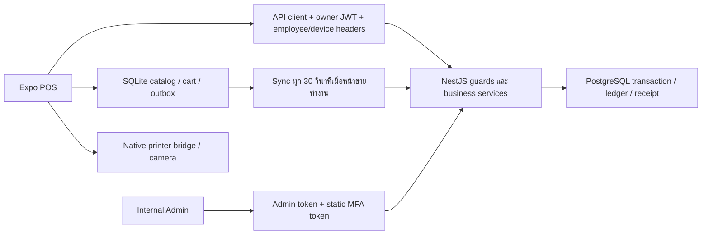

# Sunha POS — ผลตรวจระบบและแผนพัฒนาฉบับส่งต่องาน

**ติดตามงานแก้ไขล่าสุด:** [TASKS.md](TASKS.md) — รายงานนี้เก็บผลตรวจเดิม ส่วนสถานะหลังแก้อยู่ใน checklist พร้อมหลักฐานราย batch

ตรวจหลักฐาน: 10 กันยายน 2026 • เรียบเรียงเสร็จ: 11 กันยายน 2026 • HEAD: `d5ee55c` พร้อม working-tree changes

**ข้อสรุป: ยังไม่ผ่านเกณฑ์พร้อมใช้รับเงินจริงครบทุก flow** มี API และโครงสร้างหลักที่ทำงานได้ แต่ยังมีข้อผิดพลาดที่กระทบยอดเงิน การปิดกะ การยืนยันพนักงาน และการกู้คืนรายการเมื่อเครือข่ายขัดข้อง การ build ผ่านไม่เท่ากับหน้าจอและอุปกรณ์ทุกหน้าทำงานถูกต้อง

เอกสารชุดนี้เป็นผลตรวจและแผน ไม่ใช่การแก้ application ให้เสร็จแล้ว อ่านตามลำดับ:

1. เอกสารนี้ — ภาพรวม flow สถานะทุกหน้า และปัญหาพร้อมหลักฐาน
2. [IMPLEMENTATION-PLAN.md](IMPLEMENTATION-PLAN.md) — งานที่ต้องทำ ผู้รับผิดชอบ dependencies แนวทางแก้ และเกณฑ์ตรวจรับ
3. [UAT-AND-RELEASE.md](UAT-AND-RELEASE.md) — ชุดทดสอบธุรกิจ การตรวจหน้าจอ และเงื่อนไขเปิดใช้จริง
4. [evidence](evidence/) — log ของคำสั่งที่รันจริง และ [probe-local.py](probe-local.py) สำหรับทำซ้ำกรณีผิดพลาด

## 1. ขอบเขตและความน่าเชื่อถือของผลตรวจ

ตรวจ Expo POS ทั้ง 17 routes (ไม่รวม `_layout`), Internal Admin 1 route, NestJS services/controllers/guards, contracts, pricing domain, PostgreSQL schema/migrations, SQLite/outbox และ CI/deployment config อ่านแผนเดิม `production-ready-plan.md` ประกอบ แต่ไม่ใช้เครื่องหมายว่าเสร็จแล้วในแผนเดิมเป็นหลักฐานการตรวจรับ

ระดับหลักฐานที่ใช้:

- **R — รันจริง:** ผลจาก local API + PostgreSQL หรือคำสั่งตรวจที่แนบ log
- **C — ตรวจโค้ด:** พบเงื่อนไขหรือ flow ใน implementation; ยังไม่ได้จำลองครบทุกสถานการณ์
- **V — เห็นหน้าจอ:** เปิด route ผ่าน browser และอ่าน UI/ภาพ; ไม่ได้หมายความว่าบันทึกข้อมูลได้
- **U — ยังไม่ยืนยัน:** ต้องใช้ Android จริง เครื่องพิมพ์ ระบบ deployment หรือข้อมูลเพิ่มเติม

สภาพแวดล้อม: macOS, PostgreSQL 15 ในเครื่อง, ฐานข้อมูลเฉพาะ `sunha_audit_20260910_2007`, API ทดสอบ `127.0.0.1:3002`, POS web `localhost:8082`, Admin preview `localhost:3003` ไม่มีการทดสอบธุรกรรมบนร้าน production ไม่มี Android device ในผล `adb devices` ตอนตรวจ ไม่ได้ทดสอบ APK/AAB ที่เซ็นแล้ว กล้องจริง Bluetooth/LAN printer อีเมลจริง HTTPS production backup/restore หรือ load test

POS เป็น Android-first ตาม README การพบ SecureStore error บนเว็บเป็นข้อจำกัดของ web preview ที่ยืนยันได้ ไม่ใช่หลักฐานว่า Android จะ error แบบเดียวกัน การลองตั้ง browser viewport ไม่ได้ให้ภาพที่ยืนยันขนาดเป้าหมายได้ชัด จึง **ไม่ถือว่าผ่าน responsive test ที่ 360/1280** ต้องตรวจบนเครื่องเป้าหมายซ้ำ

มีไฟล์แก้ค้างก่อนตรวจ และระหว่างตรวจพบสถานะไฟล์ native printer เปลี่ยนเพิ่มเติม เอกสารนี้ไม่ย้อนทับการแก้ไขดังกล่าว ไม่รับรองว่า working tree เป็น release snapshot ที่คงที่ งานส่งต่อขั้นแรกต้อง freeze commit และตรวจผลซ้ำกับ commit นั้น

## 2. ผลทดสอบที่รันจริง

| การตรวจ                                               | ผล                                                           | ความหมายและข้อจำกัด                                                                                |
| ----------------------------------------------------- | ------------------------------------------------------------ | -------------------------------------------------------------------------------------------------- |
| `pnpm exec turbo test typecheck lint --force`         | 17 tasks ผ่าน ไม่ใช้ cache                                   | domain 14 tests + API unit 11 tests ผ่าน; integration 5 ข้อถูก skip ในคำสั่งนี้                    |
| POS/Admin/contracts tests                             | ไม่มี test files                                             | scripts ยอมผ่านด้วย `--passWithNoTests`; ไม่ใช่ UI test ผ่าน                                       |
| `pnpm exec turbo build --force`                       | 5 tasks ผ่าน                                                 | API/Next build และ Android JS export ผ่าน; ไม่ใช่ native release build                             |
| Prisma migrate deploy บนฐานข้อมูลว่าง                 | 5 migrations ผ่าน                                            | ยังไม่พิสูจน์การ upgrade ฐานข้อมูลร้านเก่าหรือ rollback                                            |
| PostgreSQL integration แยกด้วย `RUN_INTEGRATION=true` | 5/5 ผ่าน                                                     | tenant isolation, concurrent stock/retry, refund reconciliation, กะหนึ่งรอบ, offline replay/policy |
| HTTP health/readiness                                 | 200/200                                                      | readiness เชื่อมฐานข้อมูลทดสอบได้                                                                  |
| API signup/create item/checkout/report                | ทำงานในเส้นทางที่ probe ใช้                                  | ใช้ข้อมูลสมมติ; ไม่ส่งอีเมลจริง                                                                    |
| เปิด–ปิดกะสองรอบ                                      | รอบสองปิดได้ HTTP 500                                        | ยืนยันข้อผิดพลาด F01                                                                               |
| ขาย item หลัง soft-delete                             | HTTP 201                                                     | ยืนยัน F04                                                                                         |
| ส่ง `CASH_OUT` จำนวนบวก                               | HTTP 201 และ expected cash เพิ่ม                             | ยืนยัน validation gap F05; UI ปัจจุบันส่งติดลบให้เอง                                               |
| SQLite retry comparison                               | `[0, 1]`                                                     | TEXT comparison ไม่เลือก retry ที่ควรถึงเวลาแล้ว; normalized datetime เลือกได้                     |
| POS web routes                                        | เปิดโครงหน้าได้ แต่ data routes หลายหน้ามี SecureStore error | ไม่ผ่าน browser E2E; native UAT ยังต้องทำ                                                          |
| format/security scan                                  | ไม่ได้รันใน audit นี้                                        | ไม่อ้างว่า full CI หรือ dependency security ผ่าน                                                   |

หลักฐาน: `evidence/sunha-audit-checks.log`, `sunha-audit-build.log`, `sunha-audit-migrate.log`, `sunha-audit-integration.log`, `probe-local.log`

หลังจบ audit ได้หยุด API/POS web/Admin preview ที่เปิดเพื่อทดสอบและลบเฉพาะฐานข้อมูล disposable ข้างต้นแล้ว เก็บ log และ SHA-256 manifest ไว้ใน `evidence/` หากต้องทำซ้ำให้สร้างฐานข้อมูลใหม่ตามคู่มือ UAT ภาพหน้าจอที่ตรวจแสดงอยู่ในประวัติ task; เอกสารชุดนี้ไม่ได้แนบ screenshot files จึงไม่ใช้เป็น visual regression baseline

## 3. โครงสร้างและ flow ปัจจุบัน

### 3.1 เปิดร้านครั้งแรก

ผู้ใช้เปิดแอป → หน้า `/` โดยไม่มี route guard บังคับ login → เข้า create-account → signup สร้าง tenant/store/user/owner employee/device → เก็บ token และ employee/device ID → setup-store กรอกชื่อและที่อยู่ → กลับหน้าขาย

ส่วน API signup พิสูจน์ได้ แต่ onboarding ยังไม่ครบ: ไม่มีตั้ง Owner PIN ที่ใช้งานได้, ไม่มีหน้าตั้ง Manager, ไม่มี flow ลงทะเบียนเครื่องเพิ่ม, ไม่มี verification/reset routes รองรับลิงก์จากอีเมล และชื่อร้านในหน้าขายยังเป็นข้อความกำหนดตายตัว หากส่งอีเมลล้มเหลวหลังสร้างบัญชี บัญชีอาจสร้างแล้วแต่ UI เห็น error และสมัครซ้ำติด email ซ้ำ (C)

### 3.2 ขายสินค้าออนไลน์

โหลด catalog snapshot → cache SQLite → แปลงเฉพาะ `units.slice(0, 1)` → เลือกสินค้า/ค้นชื่อ SKU barcode → เพิ่มลดจำนวนเต็ม → เปิด payment sheet → ส่ง checkout → API ใช้ราคาสินค้า modifier และ tax จากฐานข้อมูล → ตัด stock แบบมีเงื่อนไขใน transaction → สร้าง order/payment/receipt → แอปล้าง cart และพยายามพิมพ์

จุดแข็ง: server ไม่เชื่อราคาที่ client ส่ง, มี BigInt pricing domain, stock guard ป้องกัน oversell, clientOrderId unique และเก็บ snapshot order line ส่วนที่ยังขาด: UI ไม่เลือกหน่วยที่สอง/required modifier, ยอด UI ไม่ใช้ pricing เดียวกับ server, discount ค้างข้ามบิล, ไม่มี persistent checkout identity ก่อนส่ง และ auto-print ไม่แสดงข้อผิดพลาด

### 3.3 เน็ตหลุดและ offline

แอปลอง checkout ออนไลน์ก่อน → เมื่อ error ไม่ใช่ ApiError และ policy อนุญาตเครื่องเดียวพร้อม lease ไม่หมดอายุ → enqueue CHECKOUT_ORDER → ล้าง cart → sync จากหน้าขายทุก 30 วินาที → server apply แล้วบันทึก ACKED/FAILED_REVIEW

flow นี้ยังไม่ใช่ offline-first ที่กู้คืนได้ครบ: policy อยู่ใน memory, restart offline อาจไม่อนุญาตขาย; ไม่จอง stock ท้องถิ่น; ไม่สร้างใบเสร็จ offline ที่ตรวจได้; retry timestamp ผิดรูปแบบ; Sync Center แสดง queue server แทน local; pull อ่านแต่ไม่ apply operations; ตรวจ lease ด้วยเวลาที่ sync; ไม่มี transaction ร่วมระหว่าง apply operation กับบันทึกผล sync งานพวกนี้ต้องแก้ก่อนสัญญาว่าเน็ตล่มแล้วยังขายต่อได้อย่างปลอดภัย

### 3.4 คืนเงิน

เปิดประวัติใบเสร็จ → กดคืน → ดึง employees และเลือก manager คนแรก หรือ owner → กรอก PIN/เหตุผล → server ตรวจสิทธิ์ REFUND และ PIN → คืน stock + payment reversal + เปลี่ยน order status + audit ใน transaction

คืนเต็มบิลมีฐานข้อมูลป้องกัน refund ซ้ำด้วย unique orderId และ integration เดิมผ่าน แต่ cashier ไม่มี REFUND และไม่มี MANAGE_EMPLOYEES; manager ก็ไม่มี MANAGE_EMPLOYEES ใน role matrix ปัจจุบัน ขณะที่หน้า refund ต้องเรียก listEmployees ก่อน จึงติดขั้นเลือกผู้อนุมัติ อีกทั้ง owner มี random PIN hash ที่สมัครแล้วไม่รู้ PIN และแก้ owner ผ่าน employee endpoint ไม่ได้ เป็น flow ที่ยังไม่ครบสำหรับร้านใหม่

### 3.5 เปิด–ปิดกะ

หน้า shifts แสดงฟอร์มเปิด เงินเข้า/ออก และปิดพร้อมกัน → API ใช้กะร่วมระดับร้าน → คำนวณ expected cash จาก opening + cash payments ของ order ที่สร้างหลังเปิดกะ + movements → เทียบยอดนับจริง

ไม่มี shiftId บน order/payment; ขายได้โดยไม่เปิดกะ; การคืนบิลเก่าข้ามกะอาจไม่เข้า expected cash ของกะปัจจุบัน เพราะกรองเวลาสร้าง order แทนเวลาของเงินคืน และ pending operations ที่ยังอยู่บนอุปกรณ์ไม่ถูกนับโดย server close-shift การปิดกะครั้งที่สอง error ถูกพิสูจน์แล้ว

### 3.6 การจัดการและรายงาน

POS มีหน้าสินค้า หมวด ตัวเลือกเสริม ภาษี พนักงาน และ stock แต่ UI ครอบคลุม API เพียงบางส่วน Reports เรียกยอดรวมและตามวิธีชำระโดยไม่เลือกวันที่ ส่วน Admin เป็น internal operations console สำหรับผู้ดูแลแพลตฟอร์ม ไม่ใช่ back office ของเจ้าของร้าน มี overview/list/suspend แต่ยังไม่มีหน้ารายละเอียด device/sync/audit แม้ backend มี endpoint

## 4. สถานะทุกหน้า

ทุก route ด้านล่างได้อ่านโค้ดและเปิดผ่าน browser อย่างน้อยหนึ่งครั้ง การแสดงหน้าหรือ empty state ไม่ใช่การผ่าน save/delete/checkout; authenticated UI flow ถูกจำกัดด้วย SecureStore บนเว็บ

| หน้า / ไฟล์ `apps/pos/app/`           | ทำอะไรได้จาก implementation                        | ช่องว่างที่ต้องทำ                                                        | สถานะ                             |
| ------------------------------------- | -------------------------------------------------- | ------------------------------------------------------------------------ | --------------------------------- |
| `/` — `index.tsx`                     | แคตตาล็อก search cart payment online/fallback      | ยอดจริง, modifier/หน่วย, session guard, offline durable, สถานะจริง       | C,V; API แยก R                    |
| `/login`                              | ส่ง login เก็บ token                               | refresh/logout, reset link, error translation                            | C,V; forgot button ไม่มีผล        |
| `/create-account`                     | signup owner/store/device                          | PIN, verification, recovery หลัง signup สำเร็จบางขั้น                    | C,V; signup API R                 |
| `/setup-store`                        | บันทึกชื่อ/ที่อยู่                                 | โหลดค่าร้านเดิม, phone/tax number, validation, currency read-only        | C,V                               |
| `/employee-pin`                       | แป้นตัวเลข/จุด PIN                                 | verify API และ session switch จริง; grid 3×4                             | C,V; ปัจจุบันแค่กลับหน้าขาย       |
| `/items`                              | เพิ่ม/แก้ item และหน่วยแรก; category create/delete | assign category, track stock, cost/image, หลายหน่วย, modifier assignment | C,V; create API R                 |
| `/modifiers`                          | group และ options บางส่วน                          | required/min/max UI, assign สินค้า, feedback/recovery                    | C,V; web data error               |
| `/taxes`                              | create/edit/disable                                | ใส่ % แทน basis points; เลือก inclusive/exclusive; error state           | C,V; web data error               |
| `/employees`                          | เพิ่ม cashier แก้ชื่อ/PIN ปิดใช้                   | role manager, owner PIN, back/scroll, reset/lock status                  | C,V; API create R                 |
| `/stock`                              | ดูยอดคงเหลือ                                       | รับเข้า/ปรับยอดพร้อมอนุมัติ, ledger, หน่วย, search, stable ID            | C,V; ไม่มี adjustment UI          |
| `/receipts`                           | list/search/share/reprint/refund modal             | itemized detail, approval flow, pagination, offline receipts             | C,V; refund service integration R |
| `/shifts`                             | เรียกเปิด/เงินเข้าออก/ปิด                          | current shift, history, business locking, repeated cycles                | C,V,R; รอบสองล้มเหลว              |
| `/reports`                            | net sales และ payment summary                      | date range, drilldown, error/retry, refunds reconciliation, export UI    | C,V,R บาง API                     |
| `/settings`                           | คำอธิบายและปุ่มกลับ                                | settings จริงทั้งหมดตามขอบเขต                                            | C,V; placeholder                  |
| `/sync`                               | server operations และ retry                        | local pending/failed, last sync, แก้ conflict, role-aware actions        | C,V; ไม่ใช่ local queue monitor   |
| `/barcode`                            | permission screen, ค้นชื่อจาก barcode              | ส่ง unit เข้า cart, debounce, not-found/manual fallback                  | C,V; ไม่ทดสอบกล้องจริง            |
| `/printers`                           | profile save/list/test 58/80mm Bluetooth/LAN       | default/edit/delete, queue/retry, native packaging, itemized Lao print   | C,V; hardware U                   |
| Admin `/` — `apps/admin/app/page.tsx` | token login, overview, stores, suspend             | identity/MFA จริง, audit/device detail, recovery/unsuspend, pagination   | C,V; ไม่ลอง suspend ร้านจริง      |

## 5. ปัญหาเรียงตามผลกระทบ

P0 = ต้องแก้ก่อนรับเงินจริงใน flow ที่เกี่ยวข้อง; P1 = ต้องเสร็จก่อน pilot ครบขอบเขต; P2 = ปรับคุณภาพ/ประสิทธิภาพก่อนขยาย ทั้งหมดเป็นรายการเปิด ณ วันตรวจ

### F01 — P0: ปิดกะครั้งที่สองล้มเหลว (R,C)

หลักฐาน `apps/api/prisma/schema.prisma` model Shift และ baseline SQL มี unique `(storeId,isOpen)` จึงอนุญาตแถว false เพียงหนึ่งแถวต่อร้าน Probe เปิด/ปิดรอบแรกได้ เปิดรอบสองได้ แต่ปิดรอบสอง HTTP 500

แก้เป็น unique เฉพาะกะที่เปิดอยู่ พร้อม transaction สำหรับเปิด/ปิด/เงินเข้าออกและ audit ต้องเพิ่ม migration ใหม่โดยรักษาประวัติเดิม ใช้ partial unique index ตามหลัก [PostgreSQL Partial Indexes](https://www.postgresql.org/docs/16/indexes-partial.html) งาน T02

### F02 — P0: ยอดชำระและเงินทอนบน UI ไม่ตรง server (C,R ประกอบ)

`index.tsx` ใช้ `subtotal` เป็นยอดใน payment และเงินทอน ขณะที่ `order.service.ts` คำนวณ discount/tax จริง ตัวอย่างทดสอบสินค้า 10,000 + ภาษีทดสอบ 10% รับ 20,000: API total 11,000/change 9,000 แต่สูตร UI แสดง subtotal 10,000/change 10,000; กรณีนี้เป็นการเทียบโค้ด UI กับผล API ไม่ใช่การกดชำระบน Android และยังไม่มี `setDiscountAmount('')` หลังสำเร็จ ทำให้ส่วนลดอาจติดบิลถัดไป งาน T03

### F03 — P0: ยืนยันพนักงานและ device identity ยังไม่สมบูรณ์ (C,R บางส่วน)

หน้า PIN ไม่เรียก verify-pin; guard เชื่อ employee/device ID จาก header ประกอบ owner JWT โดยไม่ผูกกับหลักฐาน PIN/session ของพนักงาน API probe เปลี่ยน header เป็น cashier ได้ 403 สำหรับ list employees แล้วใช้ owner header กับ JWT เดิมได้ 200 โดยไม่ได้ verify PIN นี่แสดงว่า header เป็นตัวเลือกระดับสิทธิ์ภายใน owner session ไม่ใช่หลักฐานว่าผู้ไม่มี JWT เข้าถึงได้

login ยังคืน owner device ID ตัวแรกจากฐานข้อมูล จึงไม่พิสูจน์ว่าเป็นเครื่องจริงตัวเดิม; จำนวน active devices อาจไม่สะท้อนเครื่องที่ login จริง งาน T04

### F04 — P0: สินค้าปิดใช้ยังขายได้ (R,C)

`OrderService.checkout` resolve unit ด้วย tenant แต่ไม่กรอง `item.active`/`unit.active` Probe soft-delete item แล้วส่ง checkout ID ใหม่ได้ 201 Cached cart/คำขอเก่ายังใช้ขายได้ แก้ตรวจ active และ version/snapshot policy ใน transaction; offline ต้องมีข้อกำหนดจัดการสินค้าที่ปิดใช้หลังขายไปแล้ว งาน T03/T07

### F05 — P0: สมุดเงินสดและการผูกกะไม่ครบ (R,C)

cashMovementSchema ยอม signed amount โดยไม่บังคับให้สอดคล้อง type; API `CASH_OUT=100` ทำ expected เพิ่มจาก 1,000 เป็น 1,100 ทั้งที่ควรเหลือ 900 UI ส่งค่าลบให้เองจึงไม่ใช่ข้อผิดพลาดของปุ่ม Cash out ใน happy path แต่ server ยังรับข้อมูลผิดได้ ขายโดยไม่เปิดกะได้ 201 และ expectedCash กรองตาม order.createdAt ทำให้ refund ของบิลกะเก่าอาจไม่รวม เงินและกะไม่มีความสัมพันธ์ถาวร งาน T02

### F06 — P0: retry อาจสร้างการขายซ้ำเมื่อผลเครือข่ายไม่แน่ชัด (C)

`index.tsx` สร้าง clientOrderId ใหม่ทุกครั้งกด checkout และไม่เก็บก่อน request กรณี server commit แล้ว response หาย แต่ offline fallback ไม่อนุญาต ผู้ใช้กดใหม่จะใช้ ID ใหม่ แม้ server ป้องกัน ID ซ้ำได้ก็ไม่ช่วยกรณีนี้ Probe ยืนยันเฉพาะ retry ด้วย ID เดิมคืน order เดิม และ payload ที่เปลี่ยนแต่ใช้ ID เดิมก็คืน order เดิมโดยไม่แจ้ง conflict ยังไม่ได้จำลอง response-loss จริง งาน T05

### F07 — P0: local retry ถึงเวลาแล้วไม่ถูกเลือก (R,C)

`outbox.ts` บันทึก ISO `...T...Z` แต่ query เทียบกับ `datetime('now')` ที่ใช้ช่องว่าง เป็น TEXT comparison ในวันเดียวกัน ตัวอย่าง 10:00 เทียบ 11:00 ได้ false; แปลง datetime ทั้งสองข้างได้ true และ retry delay เรียก attempt=1 ตลอด แก้เก็บ epoch milliseconds และทดสอบ clock/backoff ด้วย [SQLite Date Functions](https://www.sqlite.org/lang_datefunc.html) งาน T06

### F08 — P0: offline acceptance และ reconciliation ยังมีช่องว่าง (C)

`sync-client.ts` เก็บ cursor แต่ไม่ apply pulled operations; catch ของ pull สามารถ mark operations ที่ ACKED กลับ PENDING; ไม่มี single-flight lock ระหว่าง sync รอบนาน; local cart กับ outbox ไม่ได้ commit ร่วมกัน; `sync.service.ts` apply กับบันทึก sync result คนละ transaction และไม่ใช้ dependsOn; timestamp ของ order ใช้เวลา server จึงอาจจัดยอดขาย offline ผิดวัน

policy ไม่ persist/renew ใน POS และใช้เวลาขณะ sync ตรวจ lease ทำให้ขายตอน lease ยังดีแต่กลับมาออนไลน์ช้าแล้วเข้า FAILED_REVIEW ได้ ต้องจัดการอย่างเป็นธุรกรรมและมีผู้รับผิดชอบกระทบยอด ไม่ใช่กด retry ซ้ำอย่างเดียว งาน T05–T07

### F09 — P0: local data ไม่แบ่ง tenant และไม่มี migration จริง (C)

`local-db.ts` ใช้ DB เดียวและ cart/catalog id=1; tokens ไม่มี flow ล้างหรือ partition business cache เมื่อเปลี่ยนร้าน; snapshot fallback ใช้ cache แม้ auth error โค้ด CREATE TABLE IF NOT EXISTS แล้วเขียน version=2 ไม่ได้ ALTER schema เก่าที่ขาด column นอกจากนี้สร้าง key ใน SecureStore แต่ไม่ใช้เปิด SQLCipher จึงยังไม่เข้ารหัส DB งาน T08

### F10 — P1: refund approval ใช้งานไม่ครบ และ rounding คนละสูตร (C)

หน้า receipt ต้อง listEmployees ก่อนซึ่งจำกัด OWNER; cashier ถูก REFUND guard ปฏิเสธ แม้มี manager PIN; owner สมัครใหม่มี random PIN และแก้ไขไม่ได้ UI เพิ่มได้แต่ cashier จึงไม่มีเส้นทางตั้ง manager ให้ร้านใหม่ผ่าน UI

`refund.service.ts` ใช้ integer division ตัดเศษใน multiplyQuantity แต่ domain ใช้ half-up ตัวอย่าง quantity 0.001 × multiplier 0.5: sale ตัด 0.001 base แต่สูตร refund คืน 0 ส่วนนี้พบจากโค้ด ยังไม่ได้ทดสอบ DB กรณีเศษดังกล่าว ต้องเก็บ base quantity ที่ตัดจริงแล้วคืนจาก snapshot งาน T09

### F11 — P1: session หมดอายุแล้วขายสะดุด และ recovery ไม่ต่อกัน (C,V)

access token 900 วินาที แต่ api client ไม่มี refresh/retry เมื่อ 401 ไม่มี getter refresh token ใน POS และไม่มี logout UI ปุ่ม forgot password เป็น no-op ไม่มี verify-email/reset-password routes ตามลิงก์ email provider งาน T04/T10

### F12 — P1: catalog/sale UI ยังไม่ครอบคลุมความสามารถ backend (C)

items ตั้ง trackStock=false, ไม่ส่ง categoryId, หน่วยแรกเท่านั้น; หน้าขายไม่เลือก modifiers และส่ง array ว่าง ทำ required modifier ขายไม่ผ่าน; barcode แสดงชื่อแต่ไม่เพิ่ม cart; stock อ่านอย่างเดียว งาน T11/T12

### F13 — P1: พิมพ์ใบเสร็จยังไม่พร้อมตรวจรับ (C,U)

auto-print พิมพ์เพียงชื่อระบบ/เลขใบเสร็จและกลืน error; reprint เป็น summary ไม่ใช้ line details แม้ ReceiptService คืน lines/modifiers แล้ว ใน HEAD มี native module แต่ working tree ตอนตรวจภายหลังแสดงลบ module/package และแก้ registration จึงต้องยืนยัน native artifact ใหม่ก่อนสรุปว่า driver มีอยู่ใน build รหัสเดิมเขียน UTF-8 ตรง ๆ และยังไม่ได้ยืนยัน Lao glyph กับ printer จริง งาน T13

### F14 — P1: Reports/Sync แสดงข้อมูลไม่พอสำหรับตัดสินใจ (C,V)

Reports catch error เงียบ ทำ spinner ค้างเมื่อ sales=null; ไม่มีวันที่หรือช่วงเวลา; net sales หัก refund แต่ byEmployee/byDevice บวก order รวมโดยไม่หัก refund จึงรวม breakdown แล้วไม่เท่ากับ net total หากตีความเป็นตัวชี้วัดเดียวกัน Sync Center อ่าน server list ไม่เห็นรายการค้างในอุปกรณ์ งาน T07/T14

### F15 — P1: UI ยังไม่สม่ำเสมอและบางสถานะอ่านยาก (C,V)

หน้าขาย dark/orange แต่ฟอร์มหลายหน้า fixed light/teal; PIN keypad wrap เป็นห้าคอลัมน์ในภาพที่ตรวจ ไม่ใช่แป้น 3×4; employees/taxes/modifiers ไม่มีปุ่มกลับใน app เมื่อ stack header ถูกซ่อน และใช้ View/map ที่ไม่ scroll; barcode permission ใช้ตัวอักษรขาวบนพื้นอ่อนจนอ่านยาก ปุ่มหลายแห่งเป็น Text onPress ไม่มี role/button feedback; input หลายตัวมีแต่ placeholder งาน T15

### F16 — P1: สถานะร้าน/เครือข่ายบางจุดเป็นข้อมูลตายตัว (C,V)

ชื่อร้านตัวอย่าง, bill #001 และ online label ใน `index.tsx` ไม่ได้ผูกสถานะจริง ทำให้ผู้ขายเข้าใจว่าออนไลน์ทั้งที่ sync ไม่ทำงาน หรือเห็นชื่อร้านผิด ต้องใช้ store/session/connectivity/queue state จริง และแยก app reachability จากอินเทอร์เน็ต งาน T07/T15

### F17 — P1: Settings และ Admin ยังขาด flow ปฏิบัติงาน (C,V)

settings เป็น ModulePlaceholder; Admin มี static MFA string อีกหนึ่งค่า ไม่ใช่การพิสูจน์ปัจจัยที่สองที่หมุนเวียนหรือแยกอุปกรณ์ ไม่มี operator identity ต่อคน ไม่มี restore/unsuspend UI และรายละเอียดร้านสำหรับแก้ sync งาน T10/T16

### F18 — P1: release evidence และเอกสารเดิมยังไม่ตรงขอบเขต (C)

CI ไม่มี PostgreSQL service/คำสั่ง RUN_INTEGRATION จึงข้าม integration; POS/Admin ไม่มี UI tests; แผนเดิมติ๊ก shared pricing/cart modifier บางรายการแล้ว แต่ POS ใช้ number/subtotal และ modifier ว่าง README ยังบอก phase2 ในขณะที่ระบบขยายแล้ว ข้อความว่า receipt API ไม่ส่ง lines ในบันทึกเดิมก็ล้าสมัย งาน T01/T17/T18

### F19 — P2: การค้นข้อมูล ปริมาณข้อมูล และ validation ยังต้อง harden (C,U)

receipt take=100 ไม่มี pagination; reports sales โหลด order ทั้งช่วงเข้าหน่วยความจำ; date range ไม่ validate ลึก; stock list key ใช้ชื่อที่อาจซ้ำ; quantity/multiplier schema ยอมศูนย์; mixed tax modes ปฏิเสธแต่ UI ยังไม่อธิบาย; CSV nested BigInt/formula-like text ต้องมี dedicated export contract และ tests ยังไม่รับรอง load/security scan งาน T14/T17

## 6. ข้อเสนอด้านหน้าตาและประสบการณ์ใช้จริง

ฐานหน้าขายมี hierarchy ค่อนข้างชัด: search → category → products → cart/payment และมีแยก tablet/cart sheet เป็นจุดเริ่มต้นที่ดี แต่ยังไม่ควรให้คะแนนความสวยทุกหน้าเป็นเปอร์เซ็นต์ เพราะ data-rich/native states ไม่ได้ตรวจจริง

แนวทาง: รักษาเอกลักษณ์ Sunha แต่ใช้ชุด component กลางและ theme policy เดียวกันทุกหน้า กำหนด header/back, form label/help/error, primary/destructive buttons, empty/error/loading states และ spacing scale แยกหน้าขายที่ต้องเร็วจากหน้าจัดการที่ต้องเห็นข้อมูลครบ โดยไม่ซ่อนยอดภาษี/ส่วนลดหรือสถานะ sync

| หลัก UX              | สิ่งที่พบ                          | ผลต่อผู้ใช้                       | วิธีแก้                                                  |
| -------------------- | ---------------------------------- | --------------------------------- | -------------------------------------------------------- |
| มองเห็นสถานะระบบ     | online คงที่ / spinner ค้าง        | ไม่รู้ว่าบันทึกจริงหรือยัง        | connected/offline/syncing/review พร้อมเวลาและจำนวนรายการ |
| ป้องกันความผิดพลาด   | payment total ไม่ตรง / ส่วนลดค้าง  | รับเงินผิดบิล                     | pricing เดียวกัน, confirmation summary, reset ต่อบิล     |
| ใช้ภาษาผู้ใช้        | basis points, error code, raw enum | เจ้าของร้านกรอกหรือแก้ปัญหาไม่ได้ | ใส่เปอร์เซ็นต์, แปล action-oriented error                |
| ควบคุมและย้อนกลับ    | บางหน้าไม่มี back/cancel           | ติด flow หรือสูญเสีย draft        | header กลาง, cancel, confirm เมื่อมีการแก้ค้าง           |
| สม่ำเสมอ             | light/dark และ keypad ต่างแบบ      | ใช้เวลาปรับตัวแต่ละหน้า           | shared theme และ keypad 3×4 ทุกขนาด                      |
| กู้คืนจากความผิดพลาด | print error ถูกกลืน / retry ไม่ชัด | เสี่ยงกดขายใหม่                   | sale success แยก print status, reprint โดยไม่ขายซ้ำ      |

คำอธิบายเงินทั้งหมดให้ใช้ LAK เป็นจำนวนเต็มและ quantity เป็น decimal string ตาม domain ปัจจุบัน ภาษี 10% ใน probe เป็น **ข้อมูลทดสอบสมมติ** ไม่ใช่คำแนะนำอัตราภาษีลาว การกำหนดอัตราจริงและเอกสารภาษีต้องมาจาก requirement ของร้านที่ยืนยันแล้ว

## 7. สิ่งที่ควรเก็บไว้และสิ่งที่ต้องตัดสินใจ

ควรเก็บ architecture monorepo, shared contracts/domain, PostgreSQL transaction, immutable order-line snapshots, unique clientOrderId/refund orderId, tenant checks, Argon2 และ health/readiness แล้วเติม flow ให้ครบ ไม่จำเป็นต้องเขียนใหม่ทั้งหมด

ข้อสมมติสำหรับแผน: Android เป็น POS หลัก; ร้านเดียวต่อ tenant; กะร่วมหนึ่งกะต่อร้าน; เงิน LAK; full refund ก่อน partial refund; offline เครื่องขายเดียวตาม policy ปัจจุบัน; QR/โอน/บัตรเป็น manual recording จนกว่าจะมี payment provider ที่ตรวจผลได้ การเปลี่ยนสมมติเหล่านี้ต้องเพิ่ม scope และ UAT ก่อนลงมือ ไม่ควรอ้างว่า manual payment คือ bank-confirmed payment

ขอบเขตที่ยังไม่มีหลักฐานว่าเป็น requirement รุ่นแรก: loyalty/customer CRM, supplier/purchase order, kitchen display, table management, split payment, partial refund, หลายสาขา, payment gateway จริง ให้จัดเป็น release ถัดไปอย่างชัดเจน ไม่วางปุ่มที่กดไม่ได้ใน flow หลัก
